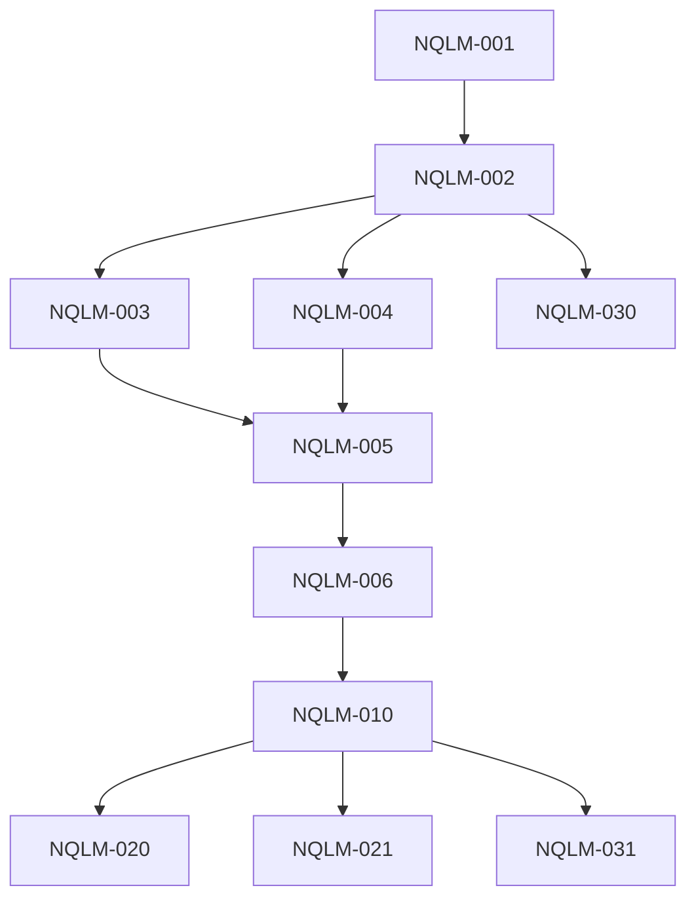

# TODO: NQL Migration - CLI REPL to @dbsp/nql

> Migration du CLI REPL vers le nouveau parser @dbsp/nql
> Source: NQL v2.0 implementation (packages/nql/)

## Status: ✅ FUNCTIONAL COMPLETE (2026-01-25)

**Spec:** docs/plans/NQLM-cli-migration.md

### Completion Summary

| Phase | Status | Notes |
|-------|--------|-------|
| Phase 1: CLI Core | ✅ Complete | nql-executor.ts, batch.ts migrated |
| Phase 2: .dbsp files | ✅ Complete | All examples migrated to v2 syntax |
| Phase 3: Documentation | ✅ Complete | QUICKSTART.md verified, CLI-NQL marked superseded |
| Phase 4: Tests | ✅ Complete | 209+ assertions passing |

---

## Overview

**Objectif:** Remplacer le parser legacy (9760 lignes) par @dbsp/nql (167 tests).

**Flow cible:**
```
NQL string → @dbsp/nql parse() → NQL AST → compile(ast, schema) → IntentAST → ORM/Adapter → SQL
```

**Changement syntaxique majeur:**
```diff
- users where name = 'Alice'          # Legacy (sans pipe)
+ users | where name = 'Alice'        # NQL v2 (avec pipe)
```

---

## Phase 1: CLI Core Migration

### NQLM-001: Ajouter @dbsp/nql comme dépendance

**Effort:** XS | **Breaking:** No

- [x] ✅ Ajouter `@dbsp/nql` dans `packages/cli/package.json` (2026-01-23)
- [x] ✅ Vérifier résolution workspace (2026-01-23)

---

### NQLM-002: Créer nql-executor.ts

**Effort:** M | **Breaking:** No

Nouveau fichier qui utilise @dbsp/nql → IntentAST → Adapter.

- [x] ✅ Créer `packages/cli/src/repl/nql-executor.ts` (2026-01-23)
- [x] ✅ Implémenter `executeNql()` et `compileNqlToSql()` (2026-01-23)
- [x] ✅ Supporter queries (SELECT) et mutations (INSERT/UPDATE/DELETE/UPSERT) (2026-01-23)
- [x] ✅ Retourner `{ sql, params, result }` pour affichage REPL (2026-01-23)
- [ ] ⏭️ Gérer les CTEs (`let` bindings) - deferred to NQL v2.1

---

### NQLM-003: Adapter batch.ts

**Effort:** S | **Breaking:** Yes

- [x] ✅ Remplacer import `./parser.js` par `./nql-executor.js` (2026-01-23)
- [x] ✅ Adapter `processBatchLine()` pour NQL v2 (2026-01-23)
- [x] ✅ Conserver support des commandes REPL (`.tables`, `.schema`, `!sql`) (2026-01-23)

---

### NQLM-004: Adapter assertion-runner.ts

**Effort:** S | **Breaking:** Yes

- [x] ✅ assertion-runner.ts pas modifié - utilise assertion-parser.ts indépendant (2026-01-23)
- [x] ✅ Assertions fonctionnent avec NQL v2 syntax (2026-01-23)

---

### NQLM-005: Mettre à jour types.ts

**Effort:** S | **Breaking:** Yes

- [x] ✅ Supprimer types legacy (`ParsedQuery`, `WhereClause`, etc.) (2026-01-23)
- [x] ✅ Types NQL importés depuis `@dbsp/nql` dans nql-executor.ts (2026-01-23)
- [x] ✅ Pas de dépendances circulaires (2026-01-23)

---

### NQLM-006: Supprimer fichiers legacy

**Effort:** S | **Breaking:** Yes

Après validation complète, supprimer :

| Fichier | Lignes | Action |
|---------|--------|--------|
| `parser.ts` | 2900 | Supprimer |
| `parser.test.ts` | 4055 | Supprimer |
| `query-executor.ts` | 1151 | Supprimer |
| `query-executor.test.ts` | 1654 | Supprimer |
| **Total** | **9760** | - |

- [x] ✅ Supprimer `packages/cli/src/repl/parser.ts` (2026-01-23) - 2900 lignes supprimées
- [x] ✅ Supprimer `packages/cli/src/repl/parser.test.ts` (2026-01-23) - 4055 lignes supprimées
- [x] ✅ Supprimer `packages/cli/src/repl/query-executor.ts` (2026-01-23) - 1151 lignes supprimées
- [x] ✅ Supprimer `packages/cli/src/repl/query-executor.test.ts` (2026-01-23) - 1654 lignes supprimées
- [x] ✅ Nettoyer types.ts des types legacy (2026-01-23) - 296 lignes supprimées

**Total supprimé:** ~10,056 lignes de code legacy

---

## Phase 2: Fichiers .dbsp Migration

### NQLM-010: Migrer syntaxe .dbsp vers NQL v2

**Effort:** M | **Breaking:** Yes

Migration de la syntaxe sans-pipe vers avec-pipe.

**Transformation:**
```diff
- table where col = 'val' limit 10
+ table | where col = 'val' | limit 10

- table select col1, col2 where x > 0
+ table | select col1, col2 | where x > 0

- table group by category select category, count(*) as cnt
+ table | group by category | select category, count(*) as cnt
```

**Fichiers à migrer (10):**

| Fichier | Taille | Description |
|---------|--------|-------------|
| `examples/minimal.dbsp` | 2.3K | Chapitre 1: users + posts |
| `examples/blog.dbsp` | 3.2K | Blog avec relations |
| `examples/blog-extended.dbsp` | 3.0K | Blog étendu |
| `examples/ecommerce.dbsp` | 2.9K | E-commerce complet |
| `examples/scheduling.dbsp` | 2.7K | Système de planning |
| `examples/pimdam.dbsp` | 3.0K | PIM/DAM assets |
| `examples/test-blog.dbsp` | 0.6K | Tests blog |
| `examples/test-blog.assert.dbsp` | 6.1K | Assertions blog |
| `examples/test-minimal.dbsp` | 0.5K | Tests minimal |
| `examples/test-minimal.assert.dbsp` | 5.0K | Assertions minimal |

- [x] ✅ Migrer `examples/minimal.dbsp` (2026-01-23)
- [x] ✅ Migrer `examples/blog.dbsp` (2026-01-23)
- [x] ✅ Migrer `examples/blog-extended.dbsp` (2026-01-23)
- [x] ✅ Migrer `examples/ecommerce.dbsp` (2026-01-23)
- [x] ✅ Migrer `examples/scheduling.dbsp` (2026-01-23)
- [x] ✅ Migrer `examples/pimdam.dbsp` (2026-01-23)
- [x] ✅ Migrer `examples/test-blog.dbsp` (2026-01-23)
- [x] ✅ Migrer `examples/test-blog.assert.dbsp` (2026-01-23)
- [x] ✅ Migrer `examples/test-minimal.dbsp` (2026-01-23)
- [x] ✅ Migrer `examples/test-minimal.assert.dbsp` (2026-01-23)

---

## Phase 3: Documentation

### NQLM-020: Mettre à jour QUICKSTART.md ✅

**Effort:** L | **Breaking:** Yes
**Completed:** 2026-01-25

- [x] ✅ QUICKSTART.md already uses v2 pipeline syntax (verified 2026-01-25)
- [x] ✅ All examples use `|` operators (e.g., `users | where name = 'Alice'`)
- [x] ✅ No migration needed - file was updated during NQL v2.0 implementation

---

### NQLM-021: Mettre à jour docs/plans/CLI-NQL-natural-query-language.md ✅

**Effort:** S | **Breaking:** No
**Completed:** 2026-01-25

- [x] ✅ Marked as superseded in doc-meta (status: superseded, superseded-by: NQL-SPEC-2026-01.md)
- [x] ✅ Added deprecation notice referencing @dbsp/nql as official implementation
- [x] ✅ Updated DOCUMENTATION_INDEX.md to reflect superseded status

---

## Phase 4: Tests et Validation

### NQLM-030: Tests CLI avec nouveau parser ✅

**Effort:** M | **Breaking:** No
**Completed:** 2026-01-25

- [x] ✅ Créer `packages/cli/src/repl/nql-executor.test.ts` (25 tests)
- [x] ✅ Tester queries SELECT via ORM
- [x] ✅ Tester mutations INSERT/UPDATE/DELETE
- [x] ✅ Tester gestion d'erreurs (parse errors, validation errors)

---

### NQLM-031: Tests E2E avec fichiers .dbsp migrés ✅

**Effort:** M | **Breaking:** No
**Completed:** 2026-01-25

- [x] ✅ Exécuter `minimal.dbsp` avec nouveau parser
- [x] ✅ Exécuter `blog.dbsp` avec nouveau parser (2 syntaxes non supportées: `count(distinct)`, `select distinct` sans colonnes)
- [x] ✅ Exécuter tous les fichiers `.assert.dbsp`:
  - `test-minimal.assert.dbsp`: 37/37 passed
  - `test-blog.assert.dbsp`: 28/28 passed
  - `ecommerce.assert.dbsp`: 73/108 passed (35 skip=DB requis)
  - `blog-extended.assert.dbsp`: 71/124 passed (53 skip=DB requis)
- [x] ✅ Valider que les résultats SQL sont identiques

---

## Dépendances



---

## Risques

| Risque | Impact | Mitigation |
|--------|--------|------------|
| Syntaxe .dbsp incompatible | HIGH | Migration fichier par fichier avec validation |
| Features manquantes NQL v2 | MEDIUM | Identifier gaps avant migration |
| Tests cassés | MEDIUM | Exécuter suite complète après chaque phase |
| Performance régression | LOW | Benchmark avant/après |

---

## Estimation

| Phase | Effort | Dépend de |
|-------|--------|-----------|
| Phase 1: CLI Core | ~8h | - |
| Phase 2: .dbsp files | ~4h | Phase 1 |
| Phase 3: Docs | ~4h | Phase 2 |
| Phase 4: Tests | ~4h | Phase 1-2 |
| **Total** | **~20h** | - |

---

## Notes

- **ORM API préservée:** Le flow passe toujours par `createOrm()` et l'adapter Kysely
- **Pas de backward compat:** L'ancienne syntaxe sera supprimée, pas de mode legacy
- **IntentAST central:** @dbsp/nql compile vers IntentAST, qui est ensuite exécuté par l'ORM

## Related

- `TODO_NQL.md` - NQL v2.0 implementation (complete)
- `docs/plans/NQL-PARSER-AUDIT-2026-01.md` - Audit et spec
- `packages/nql/` - Nouveau parser
