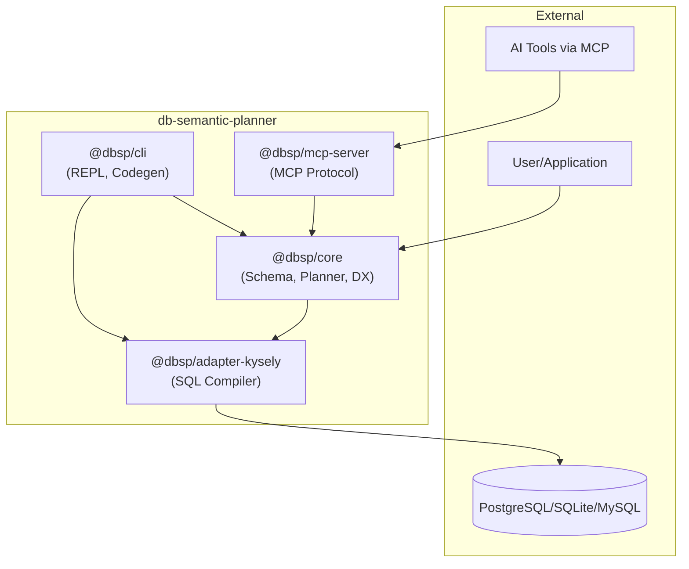
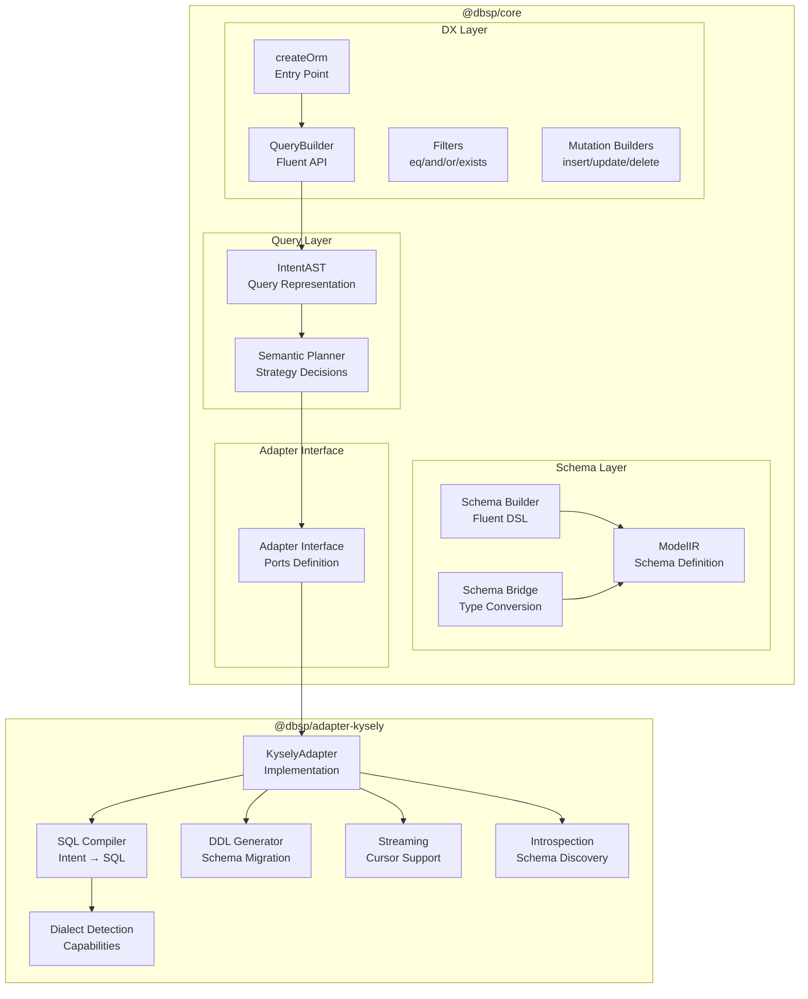
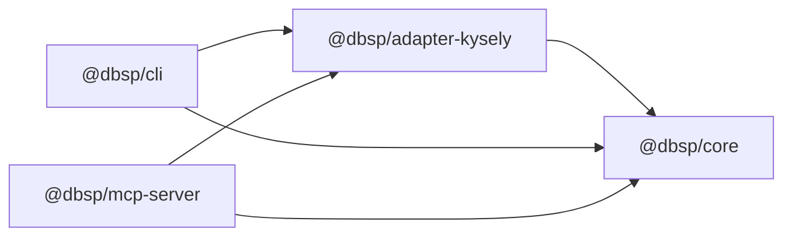
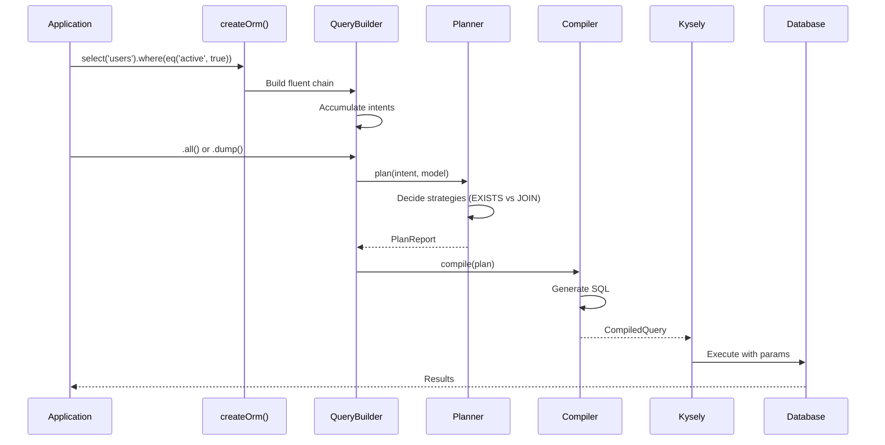

# Architecture Overview

## System Context Diagram



## Component Diagram



## Package/Module Structure

| Package | Purpose | Dependencies |
|---------|---------|--------------|
| `@dbsp/core` | DB-agnostic schema, planning, DX layer | valibot |
| `@dbsp/adapter-kysely` | SQL compilation, execution, streaming | @dbsp/core, kysely (peer) |
| `@dbsp/cli` | REPL interface, code generation | @dbsp/core, @dbsp/adapter-kysely, ink, commander |
| `@dbsp/mcp-server` | MCP protocol for AI tools | @dbsp/core, @dbsp/adapter-kysely, @modelcontextprotocol/sdk |

## Dependency Graph



## Architecture Patterns Used

| Pattern | Where | Evaluation |
|---------|-------|------------|
| Ports & Adapters | Core ↔ Adapter | ✅ Clean separation |
| Interface Segregation | Adapter interfaces | ✅ Well-designed |
| Builder Pattern | QueryBuilder, SchemaBuilder | ✅ Fluent APIs |
| Strategy Pattern | Filter/Include strategies | ✅ Configurable |
| Factory Pattern | createOrm, createKyselyAdapter | ✅ Clear entry points |
| Visitor Pattern | Intent compilation | ⚠️ Large switch statements |

## Core Package Structure

```
packages/core/src/
├── index.ts              # Public exports
├── adapter.ts            # Adapter interface definitions
├── model-ir.ts           # Schema representation
├── schema-builder.ts     # Fluent schema DSL
├── schema-dsl.ts         # DSL helpers
├── schema-dsl-types.ts   # DSL type definitions
├── intent-ast.ts         # Query intent representation
├── planner.ts            # Semantic planning logic
├── conventions.ts        # Naming conventions
├── dialects/
│   └── index.ts          # Dialect type utilities
└── dx/
    ├── index.ts          # DX layer exports
    ├── orm.ts            # createOrm, QueryBuilder
    ├── types.ts          # Type definitions
    ├── filters.ts        # eq, and, or, exists, etc.
    ├── intent-builder.ts # Intent construction
    ├── mutation-builders.ts # insert/update/delete
    ├── schema-bridge.ts  # Schema type conversion
    ├── query-executor.ts # Execution utilities
    ├── errors.ts         # Error types
    └── ...               # Additional DX modules
```

## Adapter-Kysely Package Structure

```
packages/adapter-kysely/src/
├── index.ts              # Public exports
├── kysely-adapter.ts     # KyselyAdapter implementation
├── compiler.ts           # SQL compilation (4735 lines)
├── dialect.ts            # Dialect detection & capabilities
├── ddl.ts                # DDL generation
├── dump.ts               # Query dump utilities
├── stream.ts             # Cursor/streaming support
├── explain.ts            # EXPLAIN support
├── introspection.ts      # Schema introspection
├── redact.ts             # Parameter redaction
├── errors.ts             # Adapter errors
├── types.ts              # Type definitions
└── test-utils/           # Test utilities
```

## Data Flow Overview



## Architectural Decisions

| Decision | Rationale | ADR |
|----------|-----------|-----|
| Intent-first planning | Planner decides strategy, not developer | ADR-001 |
| DX layer in core | Simplify package structure | ADR-002 |
| Ink for CLI REPL | React-like terminal UI | ADR-003 |
| Layered core structure | Clear separation of concerns | ADR-004 |
| Kysely as adapter | Type-safe, multi-dialect ready | CLAUDE.md |
| EXISTS default for to-many | Prevent row explosion | Project SKILL.md |

## Strict Dependency Rules

| Package | May Import | Must NOT Import |
|---------|------------|-----------------|
| `@dbsp/core` | Nothing (except valibot) | adapter-kysely, cli, mcp-server |
| `@dbsp/adapter-kysely` | @dbsp/core | cli, mcp-server |
| `@dbsp/cli` | @dbsp/core, @dbsp/adapter-kysely | mcp-server |
| `@dbsp/mcp-server` | @dbsp/core, @dbsp/adapter-kysely | cli |

**Enforcement:** TypeScript project references and path aliases prevent violations.
