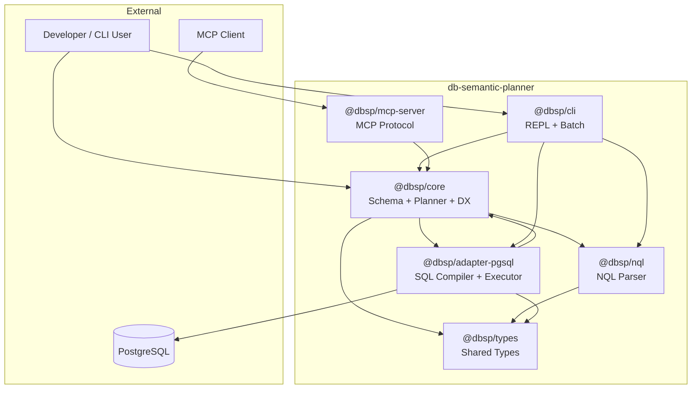
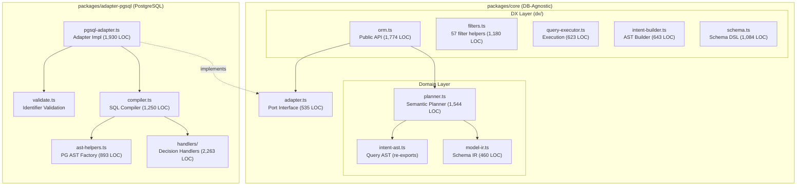
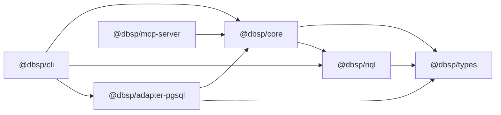
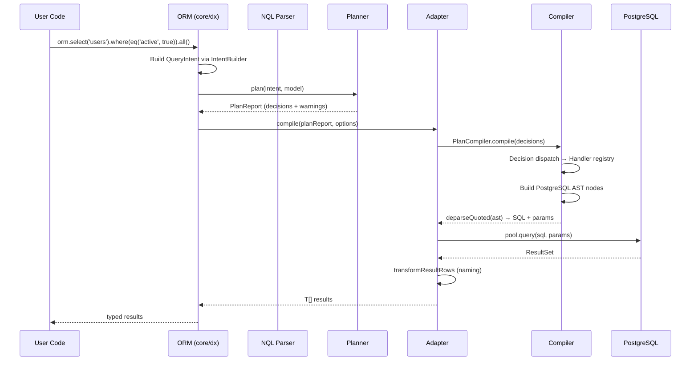

# Architecture Overview

## System Context Diagram

## Component Diagram (Ports & Adapters)

## Package Structure

| Package | Purpose | LOC | Dependencies |
|---------|---------|-----|--------------|
| `@dbsp/types` | Shared TypeScript types (IntentAST, utils) | 1,851 | none |
| `@dbsp/nql` | NQL parser (Chevrotain-based) | 4,990 | `@dbsp/types`, `chevrotain` |
| `@dbsp/core` | Schema, Planner, DX layer, Adapter interface | 19,865 | `@dbsp/nql`, `@dbsp/types`, `valibot` |
| `@dbsp/adapter-pgsql` | PostgreSQL-native SQL compiler + executor | 13,757 | `@dbsp/core`, `@dbsp/types`, `pg`, `pgsql-deparser` |
| `@dbsp/cli` | Interactive REPL + batch execution | 6,194 | `@dbsp/core`, `@dbsp/nql`, `@dbsp/adapter-pgsql`, `ink`, `commander` |
| `@dbsp/mcp-server` | Model Context Protocol server | 511 | `@dbsp/core`, `@modelcontextprotocol/sdk` |

## Dependency Graph

**Architecture Compliance:** :green_circle: No violations detected. Core does not import adapter code.

## Architecture Patterns Used

| Pattern | Where | Evaluation |
|---------|-------|------------|
| Ports & Adapters | core ↔ adapter-pgsql | :green_circle: Excellent |
| Intent-first (Declarative) | QueryIntent → PlanReport → SQL | :green_circle: Excellent |
| Discriminated Unions | IntentAST, WhereIntent, Decision | :green_circle: Proper |
| Handler Registry | adapter-pgsql/handlers/ | :green_circle: Extensible |
| Immutable Builders | QueryBuilder clone pattern | :yellow_circle: Verbose (20+ clones) |
| AST-based SQL Generation | compiler → ast-helpers → deparser | :green_circle: Secure |

## Compilation Pipeline

