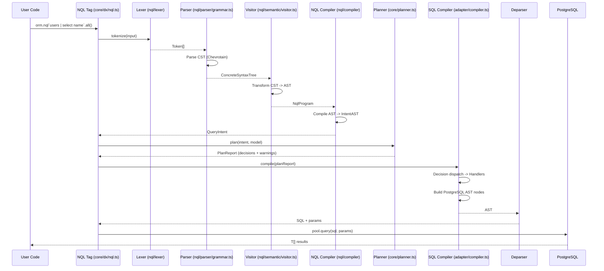
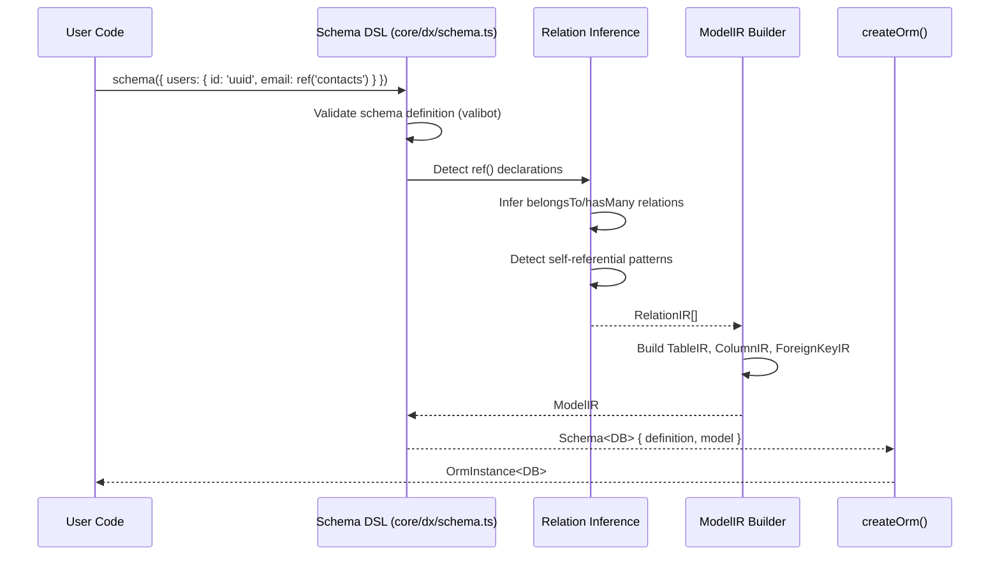
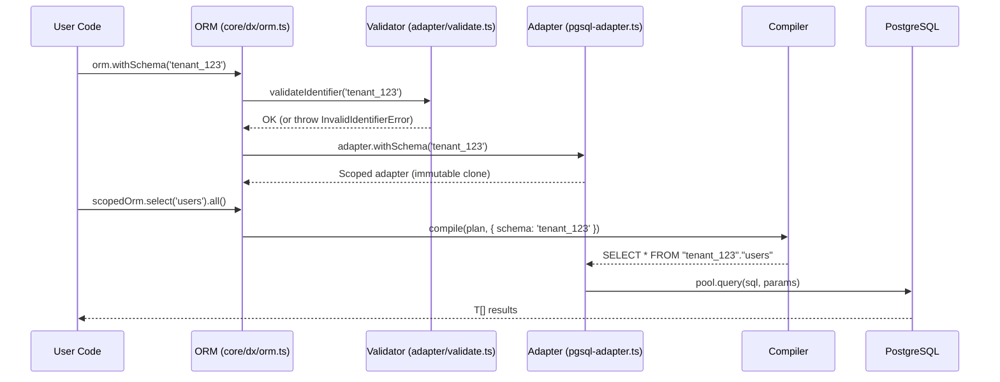
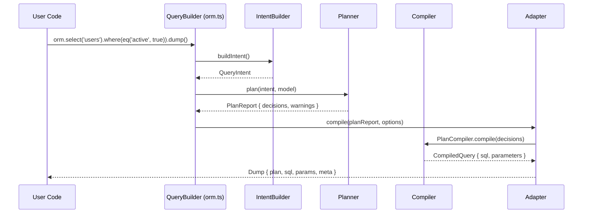
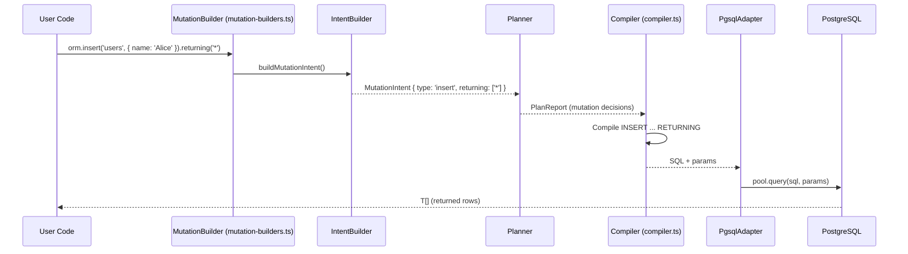
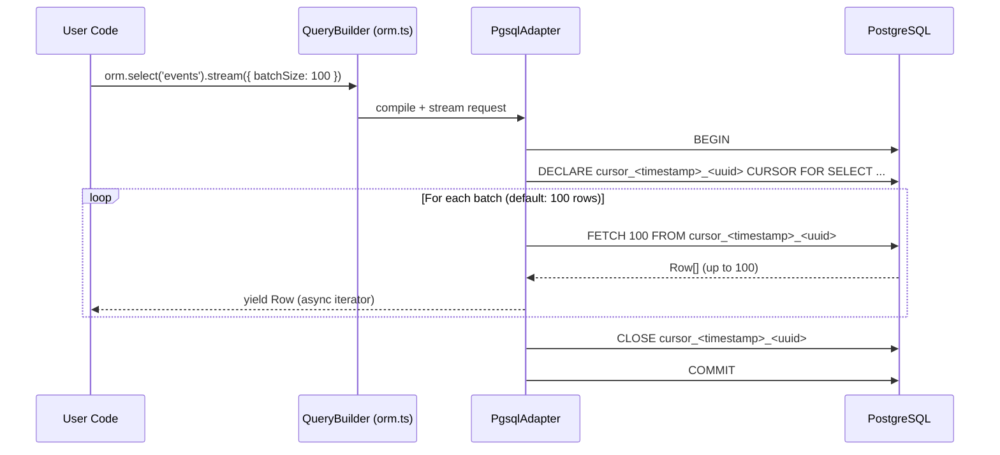

# Data Flow Analysis

**Date:** 2026-02-01
**Last updated:** 2026-02-05 (doc sync)

> ⚠️ Unverified in this refresh: line-level LOC counts and several step references (only items explicitly cited in this update are verified).

---

## Critical Path 1: NQL String -> SQL Query

### Description

The primary path from NQL query string to parameterized SQL. This is the core compilation pipeline.

### Sequence Diagram



### Step Details

| Step | File:Line | Input | Output | LOC |
|------|-----------|-------|--------|-----|
| 1. Template tag | `core/src/dx/nql.ts` | NQL string | `NqlBuilder<T>` | ⚠️ Unverified |
| 2a. Lexer | `nql/src/lexer/tokens.ts` | String | Token[] | ⚠️ Unverified |
| 2b. Parser | `nql/src/parser/grammar.ts` | Token[] | CST | ⚠️ Unverified |
| 2c. Visitor | [`packages/nql/src/semantic/visitor.ts:105`](packages/nql/src/semantic/visitor.ts:105) | CST | `NqlProgram` | Verified anchor |
| 2d. Compiler | [`packages/nql/src/compiler/index.ts:241`](packages/nql/src/compiler/index.ts:241) | `NqlProgram` | `QueryIntent` | Verified anchor |
| 3. Planner | `core/src/planner.ts` | Intent + Model | `PlanReport` | ⚠️ Unverified |
| 4. SQL Compiler | `adapter-pgsql/src/compiler.ts` | PlanReport | PostgreSQL AST | ⚠️ Unverified |
| 5. Deparser | `adapter-pgsql/src/deparse.ts` | AST | SQL string | ⚠️ Unverified |
| 6. Executor | [`packages/adapter-pgsql/src/pgsql-adapter.ts:144`](packages/adapter-pgsql/src/pgsql-adapter.ts:144) | SQL + params | `T[]` | Verified adapter entry |

**Total critical path LOC:** ~7,177

### Data Transformations

| Step | Transformation | Key Logic |
|------|---------------|-----------|
| Lexer -> Parser | String -> Token[] -> CST | Chevrotain tokenization + parsing |
| Visitor | CST -> NqlProgram (typed AST) | 40+ visitor methods, discriminated unions |
| NQL Compiler | NqlProgram -> QueryIntent | Pipe operators -> nested intents |
| Planner | Intent -> PlanReport (decisions) | Strategy selection (WHERE, JOIN, include) |
| SQL Compiler | Decisions -> PostgreSQL AST nodes | Handler dispatch per decision type |
| Deparser | AST -> parameterized SQL string | `pgsql-deparser` library |

### Security Checkpoints

| Checkpoint | Location | What's Validated |
|------------|----------|-----------------|
| NQL parsing | `nql/parser` | Syntax validation (Chevrotain grammar) |
| Value binding | `adapter-pgsql/param-ref.ts` | All values -> $N parameters |
| Identifier quoting | `adapter-pgsql/deparse.ts` | Double-quoted identifiers |

### Test Coverage

- :green_circle: NQL: `core/src/dx/nql.test.ts`
- :green_circle: NQL Compiler: `nql/tests/compiler.test.ts`
- :green_circle: Planner: `core/src/planner.test.ts`
- :green_circle: SQL Compiler: `adapter-pgsql/src/__tests__/compiler.test.ts`

---

## Critical Path 2: Schema Definition -> ModelIR

### Description

Transforms user schema DSL into the internal ModelIR representation used by the planner.

### Sequence Diagram



### Step Details

| Step | File:Line | Input | Output |
|------|-----------|-------|--------|
| 1. Schema DSL | `core/src/dx/schema.ts` | Schema definition | `Schema<DB>` (⚠️ Unverified line) |
| 2. Relation inference | `core/src/dx/schema.ts` | `ref()` declarations | `RelationIR[]` (⚠️ Unverified line) |
| 3. Model builder | `core/src/dx/schema.ts` | Tables + Relations | `ModelIR` (⚠️ Unverified line) |
| 4. ORM creation | [`packages/core/src/dx/orm.ts:308`](packages/core/src/dx/orm.ts:308) | Model + Adapter | `OrmInstance<DB>` (Verified anchor) |

### Test Coverage

- :green_circle: Schema DSL: `core/src/dx/schema.test.ts`
- :green_circle: ModelIR: `core/src/model-ir.test.ts`

---

## Critical Path 3: Multi-Tenant Query (withSchema)

### Description

Schema-scoped queries for multi-tenant applications. Security-critical path.

### Sequence Diagram



### Security Controls

| Control | Location | Description |
|---------|----------|-------------|
| Identifier validation | `validate.ts` | Regex `/^[a-zA-Z_][a-zA-Z0-9_$]*$/`, max 63 chars (⚠️ Unverified line) |
| Immutable scoping | [`packages/core/src/dx/orm.ts:325`](packages/core/src/dx/orm.ts:325) | Clone pattern prevents mutation (Verified anchor) |
| SQL quoting | `deparse.ts` | Double-quoted identifiers via deparser (⚠️ Unverified line) |
| Injection test | `pgsql-adapter.test.ts` | Verifies `tenant"; DROP TABLE` throws (⚠️ Unverified line) |

### Test Coverage

- :green_circle: Unit: `adapter-pgsql/src/pgsql-adapter.test.ts:326`
- :green_circle: E2E: `tests/e2e/pimdam.q4.multitenant.test.ts`

---

## Critical Path 4: dump() Observability

### Description

Every query is inspectable via `dump()` before execution. Returns plan decisions, compiled SQL, and bound parameters.

### Sequence Diagram



### Dump Structure

```typescript
interface Dump {
  plan: PlanReport;           // Decisions + reasoning + warnings
  sql: string;                // Parameterized SQL ($1, $2, ...)
  params: readonly unknown[]; // Bound parameter values
  meta?: {
    schema?: string;          // Multi-tenant schema name
    compiledAt: Date;
    queryName?: string;       // Optional label
    correlationId?: string;
  };
}
```

### Observability Collection Points

| Point | File | What |
|-------|------|------|
| dump() entry point | [`packages/core/src/dx/orm.ts:1153`](packages/core/src/dx/orm.ts:1153) | Dump payload construction (Verified anchor) |
| Filter strategy | `planner.ts` | WHERE vs EXISTS vs JOIN decision (⚠️ Unverified line) |
| Include strategy | `planner.ts` | json_agg vs JOIN vs lateral vs CTE (⚠️ Unverified line) |
| Ambiguity warnings | `planner.ts` | Ambiguous relation names (⚠️ Unverified line) |
| Row explosion warnings | `planner.ts` | Potential cartesian product (⚠️ Unverified line) |
| Schema context | `pgsql-adapter.ts` | Multi-tenant schema name (⚠️ Unverified line) |

### Test Coverage

- :green_circle: Unit: `adapter-pgsql/src/pgsql-adapter.test.ts:374`
- :green_circle: E2E: `tests/e2e/pimdam.q1.exists.test.ts:38`

---

## Critical Path 5: Mutation with RETURNING

### Description

INSERT, UPDATE, DELETE, and UPSERT operations with optional RETURNING clause for retrieving affected rows.

### Sequence Diagram



### RETURNING Clause Compilation

The RETURNING clause compilation path is anchored at [`packages/adapter-pgsql/src/compiler.ts:974`](packages/adapter-pgsql/src/compiler.ts:974). Specific INSERT/UPDATE/DELETE line offsets were not revalidated in this refresh.

| Mutation | Location | SQL Pattern |
|----------|----------|-------------|
| INSERT | `compiler.ts` | `INSERT INTO ... RETURNING ...` (⚠️ Unverified line) |
| UPDATE | `compiler.ts` | `UPDATE ... SET ... RETURNING ...` (⚠️ Unverified line) |
| DELETE | `compiler.ts` | `DELETE FROM ... RETURNING ...` (⚠️ Unverified line) |

### Data Transformations

| Step | Transformation |
|------|---------------|
| MutationBuilder | Fluent API -> MutationIntent |
| Compiler | MutationIntent -> INSERT/UPDATE/DELETE AST with RETURNING node |
| Deparser | AST -> parameterized SQL |
| Result hydration | Raw rows -> typed `T[]` (via ResultHydrator) |

### Security Checkpoints

| Checkpoint | What's Validated |
|------------|-----------------|
| Values | All mutation values -> $N parameters |
| Column names | Validated against ModelIR (only known columns) |
| RETURNING columns | Validated against ModelIR |
| Schema qualification | Applied if withSchema() active |

### Test Coverage

- :green_circle: Unit: `adapter-pgsql/src/__tests__/mutations.test.ts`
- :green_circle: E2E: `tests/e2e/pimdam.q3.mutations.test.ts`

---

## Critical Path 6: Streaming Query (Cursor-Based)

### Description

Large result sets streamed via PostgreSQL cursors to avoid loading all rows into memory. The async iterator yields rows one at a time, with internal cursor fetches done in batches.

### Sequence Diagram



### Cursor Management

| Aspect | Detail |
|--------|--------|
| Cursor naming | `cursor_<timestamp>_<uuid>` (timestamp + UUID) |
| Transaction | Single transaction per stream (`BEGIN` → `COMMIT`) |
| Batch size | Default 100; override via `stream({ batchSize })` |
| Cleanup | `CLOSE` cursor then `COMMIT` on normal completion |
| Error handling | Roll back on error/early stop, then attempt cursor close |

### Test Coverage

- :green_circle: Unit: [`packages/adapter-pgsql/src/__tests__/explain-streaming.test.ts:226`](packages/adapter-pgsql/src/__tests__/explain-streaming.test.ts:226)
- :green_circle: E2E: [`tests/e2e/streaming.test.ts:1`](tests/e2e/streaming.test.ts:1)

---

## Data Flow Summary

| Flow | Files Touched | Total LOC | Security | Test Coverage |
|------|---------------|-----------|----------|---------------|
| NQL -> SQL | 10+ | ~7,177 | :green_circle: Parameterized | :green_circle: Full |
| Schema -> ModelIR | 4 | ~2,500 | :green_circle: Validated | :green_circle: Full |
| withSchema | 5 | ~500 | :green_circle: Injection-proof | :green_circle: Unit + E2E |
| dump() | 6 | ~3,000 | N/A (read-only) | :green_circle: Full |
| Mutations + RETURNING | 5 | ~1,500 | :green_circle: Parameterized | :green_circle: Unit + E2E |
| Streaming (cursors) | 3 | ~400 | :green_circle: Cursor-managed | :green_circle: Unit + E2E |

---

## Deltas since last audit (2026-02-05 refresh)

- Anchored NQL pipeline entry points to `NqlCstVisitor` and `NqlCompiler` ([`packages/nql/src/semantic/visitor.ts:105`](packages/nql/src/semantic/visitor.ts:105), [`packages/nql/src/compiler/index.ts:241`](packages/nql/src/compiler/index.ts:241)).
- Anchored ModelIR creation to ORM entry in [`packages/core/src/dx/orm.ts:308`](packages/core/src/dx/orm.ts:308).
- Anchored withSchema immutable scoping in [`packages/core/src/dx/orm.ts:325`](packages/core/src/dx/orm.ts:325).
- Anchored dump() observability entry in [`packages/core/src/dx/orm.ts:1153`](packages/core/src/dx/orm.ts:1153).
- Anchored mutation RETURNING compilation path in [`packages/adapter-pgsql/src/compiler.ts:974`](packages/adapter-pgsql/src/compiler.ts:974).
- Validated streaming cursor flow (row-by-row yields, cursor naming, batch size, rollback/close behavior) and anchored tests ([`packages/adapter-pgsql/src/__tests__/explain-streaming.test.ts:226`](packages/adapter-pgsql/src/__tests__/explain-streaming.test.ts:226), [`tests/e2e/streaming.test.ts:1`](tests/e2e/streaming.test.ts:1)).
