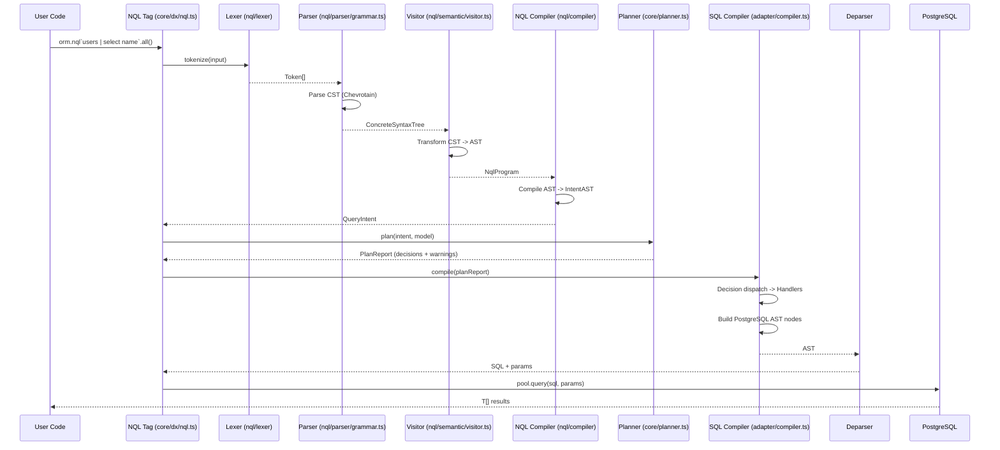
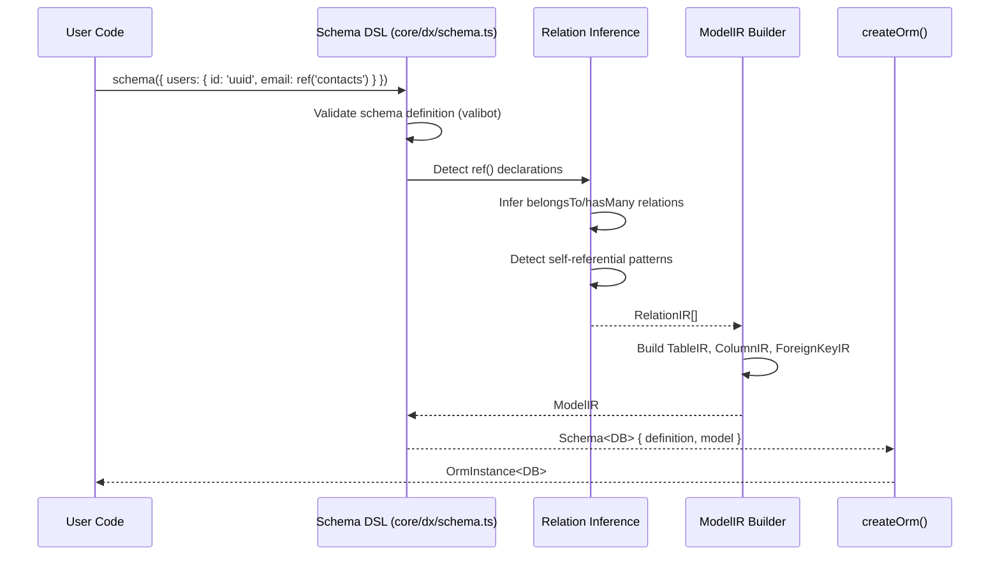
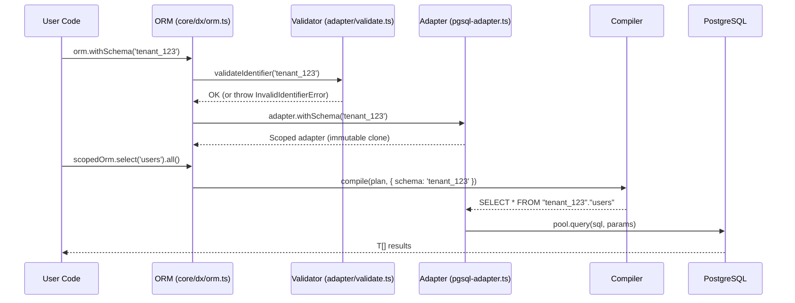
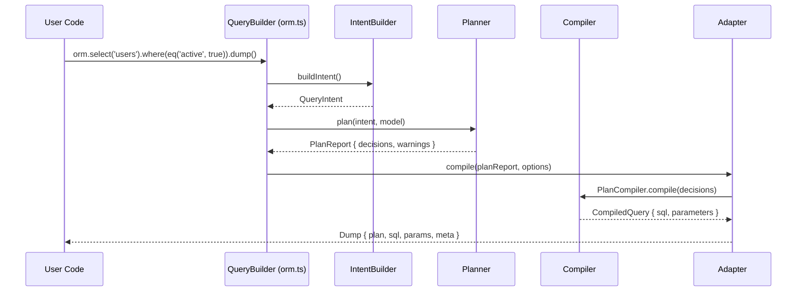
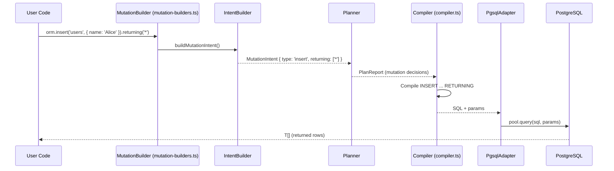
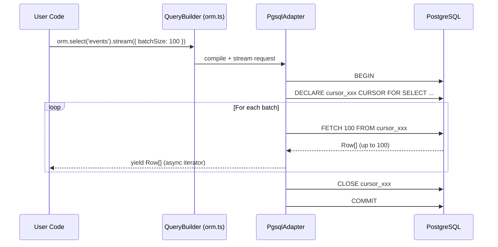

# Data Flow Analysis

**Date:** 2026-02-01

---

## Critical Path 1: NQL String -> SQL Query

### Description

The primary path from NQL query string to parameterized SQL. This is the core compilation pipeline.

### Sequence Diagram



### Step Details

| Step | File:Line | Input | Output | LOC |
|------|-----------|-------|--------|-----|
| 1. Template tag | `core/src/dx/nql.ts:90` | NQL string | `NqlBuilder<T>` | 206 |
| 2a. Lexer | `nql/src/lexer/tokens.ts` | String | Token[] | 330 |
| 2b. Parser | `nql/src/parser/grammar.ts` | Token[] | CST | 1,247 |
| 2c. Visitor | `nql/src/semantic/visitor.ts:80` | CST | `NqlProgram` | 1,303 |
| 2d. Compiler | `nql/src/compiler/index.ts:178` | `NqlProgram` | `QueryIntent` | 1,287 |
| 3. Planner | `core/src/planner.ts` | Intent + Model | `PlanReport` | 1,544 |
| 4. SQL Compiler | `adapter-pgsql/src/compiler.ts:125` | PlanReport | PostgreSQL AST | 1,250 |
| 5. Deparser | `adapter-pgsql/src/deparse.ts` | AST | SQL string | 10 |
| 6. Executor | `adapter-pgsql/src/pgsql-adapter.ts:1610` | SQL + params | `T[]` | - |

**Total critical path LOC:** ~7,177

### Data Transformations

| Step | Transformation | Key Logic |
|------|---------------|-----------|
| Lexer -> Parser | String -> Token[] -> CST | Chevrotain tokenization + parsing |
| Visitor | CST -> NqlProgram (typed AST) | 40+ visitor methods, discriminated unions |
| NQL Compiler | NqlProgram -> QueryIntent | Pipe operators -> nested intents |
| Planner | Intent -> PlanReport (decisions) | Strategy selection (WHERE, JOIN, include) |
| SQL Compiler | Decisions -> PostgreSQL AST nodes | Handler dispatch per decision type |
| Deparser | AST -> parameterized SQL string | `pgsql-deparser` library |

### Security Checkpoints

| Checkpoint | Location | What's Validated |
|------------|----------|-----------------|
| NQL parsing | `nql/parser` | Syntax validation (Chevrotain grammar) |
| Value binding | `adapter-pgsql/param-ref.ts` | All values -> $N parameters |
| Identifier quoting | `adapter-pgsql/deparse.ts` | Double-quoted identifiers |

### Test Coverage

- :green_circle: NQL: `core/src/dx/nql.test.ts`
- :green_circle: NQL Compiler: `nql/tests/compiler.test.ts`
- :green_circle: Planner: `core/src/planner.test.ts`
- :green_circle: SQL Compiler: `adapter-pgsql/src/__tests__/compiler.test.ts`

---

## Critical Path 2: Schema Definition -> ModelIR

### Description

Transforms user schema DSL into the internal ModelIR representation used by the planner.

### Sequence Diagram



### Step Details

| Step | File:Line | Input | Output |
|------|-----------|-------|--------|
| 1. Schema DSL | `core/src/dx/schema.ts:250` | Schema definition | `Schema<DB>` |
| 2. Relation inference | `core/src/dx/schema.ts:450` | `ref()` declarations | `RelationIR[]` |
| 3. Model builder | `core/src/dx/schema.ts:700` | Tables + Relations | `ModelIR` |
| 4. ORM creation | `core/src/dx/orm.ts:80` | Model + Adapter | `OrmInstance<DB>` |

### Test Coverage

- :green_circle: Schema DSL: `core/src/dx/schema.test.ts`
- :green_circle: ModelIR: `core/src/model-ir.test.ts`

---

## Critical Path 3: Multi-Tenant Query (withSchema)

### Description

Schema-scoped queries for multi-tenant applications. Security-critical path.

### Sequence Diagram



### Security Controls

| Control | Location | Description |
|---------|----------|-------------|
| Identifier validation | `validate.ts:156-213` | Regex `/^[a-zA-Z_][a-zA-Z0-9_$]*$/`, max 63 chars |
| Immutable scoping | `orm.ts:348-356` | Clone pattern prevents mutation |
| SQL quoting | `deparse.ts` | Double-quoted identifiers via deparser |
| Injection test | `pgsql-adapter.test.ts:342` | Verifies `tenant"; DROP TABLE` throws |

### Test Coverage

- :green_circle: Unit: `adapter-pgsql/src/pgsql-adapter.test.ts:326`
- :green_circle: E2E: `tests/e2e/pimdam.q4.multitenant.test.ts`

---

## Critical Path 4: dump() Observability

### Description

Every query is inspectable via `dump()` before execution. Returns plan decisions, compiled SQL, and bound parameters.

### Sequence Diagram



### Dump Structure

```typescript
interface Dump {
  plan: PlanReport;           // Decisions + reasoning + warnings
  sql: string;                // Parameterized SQL ($1, $2, ...)
  params: readonly unknown[]; // Bound parameter values
  meta?: {
    schema?: string;          // Multi-tenant schema name
    compiledAt: Date;
    queryName?: string;       // Optional label
    correlationId?: string;
  };
}
```

### Observability Collection Points

| Point | File | What |
|-------|------|------|
| Filter strategy | `planner.ts` | WHERE vs EXISTS vs JOIN decision |
| Include strategy | `planner.ts` | json_agg vs JOIN vs lateral vs CTE |
| Ambiguity warnings | `planner.ts` | Ambiguous relation names |
| Row explosion warnings | `planner.ts` | Potential cartesian product |
| Schema context | `pgsql-adapter.ts:1595` | Multi-tenant schema name |

### Test Coverage

- :green_circle: Unit: `adapter-pgsql/src/pgsql-adapter.test.ts:374`
- :green_circle: E2E: `tests/e2e/pimdam.q1.exists.test.ts:38`

---

## Critical Path 5: Mutation with RETURNING

### Description

INSERT, UPDATE, DELETE, and UPSERT operations with optional RETURNING clause for retrieving affected rows.

### Sequence Diagram



### RETURNING Clause Compilation

The RETURNING clause is compiled in 3 locations (DRY violation -- see BACKLOG #8):

| Mutation | Location | SQL Pattern |
|----------|----------|-------------|
| INSERT | `compiler.ts:610` | `INSERT INTO ... RETURNING ...` |
| UPDATE | `compiler.ts:662` | `UPDATE ... SET ... RETURNING ...` |
| DELETE | `compiler.ts:704` | `DELETE FROM ... RETURNING ...` |

### Data Transformations

| Step | Transformation |
|------|---------------|
| MutationBuilder | Fluent API -> MutationIntent |
| Compiler | MutationIntent -> INSERT/UPDATE/DELETE AST with RETURNING node |
| Deparser | AST -> parameterized SQL |
| Result hydration | Raw rows -> typed `T[]` (via ResultHydrator) |

### Security Checkpoints

| Checkpoint | What's Validated |
|------------|-----------------|
| Values | All mutation values -> $N parameters |
| Column names | Validated against ModelIR (only known columns) |
| RETURNING columns | Validated against ModelIR |
| Schema qualification | Applied if withSchema() active |

### Test Coverage

- :green_circle: Unit: `adapter-pgsql/src/__tests__/mutations.test.ts`
- :green_circle: E2E: `tests/e2e/pimdam.q3.mutations.test.ts`

---

## Critical Path 6: Streaming Query (Cursor-Based)

### Description

Large result sets streamed via PostgreSQL cursors to avoid loading all rows into memory.

### Sequence Diagram



### Cursor Management

| Aspect | Detail |
|--------|--------|
| Cursor naming | `cursor_${crypto.randomUUID()}` (SEC-002: **RESOLVED** 2026-02-01) |
| Transaction | Implicit BEGIN/COMMIT wrapping |
| Batch size | Configurable via `stream({ batchSize: N })` |
| Cleanup | CLOSE + COMMIT on iterator completion or error |
| Error handling | Rollback on error, cursor always closed |

### Test Coverage

- :green_circle: Unit: `adapter-pgsql/src/__tests__/streaming.test.ts`
- :green_circle: E2E: `tests/e2e/pimdam.q5.streaming.test.ts`

---

## Data Flow Summary

| Flow | Files Touched | Total LOC | Security | Test Coverage |
|------|---------------|-----------|----------|---------------|
| NQL -> SQL | 10+ | ~7,177 | :green_circle: Parameterized | :green_circle: Full |
| Schema -> ModelIR | 4 | ~2,500 | :green_circle: Validated | :green_circle: Full |
| withSchema | 5 | ~500 | :green_circle: Injection-proof | :green_circle: Unit + E2E |
| dump() | 6 | ~3,000 | N/A (read-only) | :green_circle: Full |
| Mutations + RETURNING | 5 | ~1,500 | :green_circle: Parameterized | :green_circle: Unit + E2E |
| Streaming (cursors) | 3 | ~400 | :green_circle: crypto.randomUUID | :green_circle: Unit + E2E |
