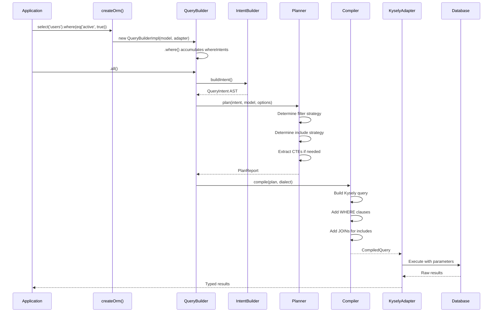
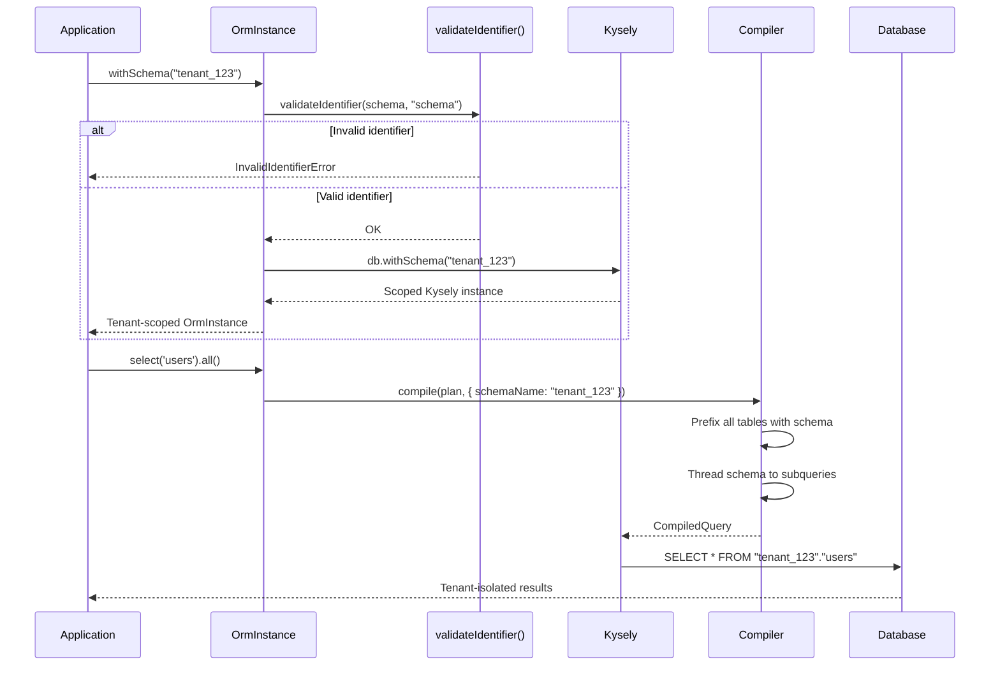
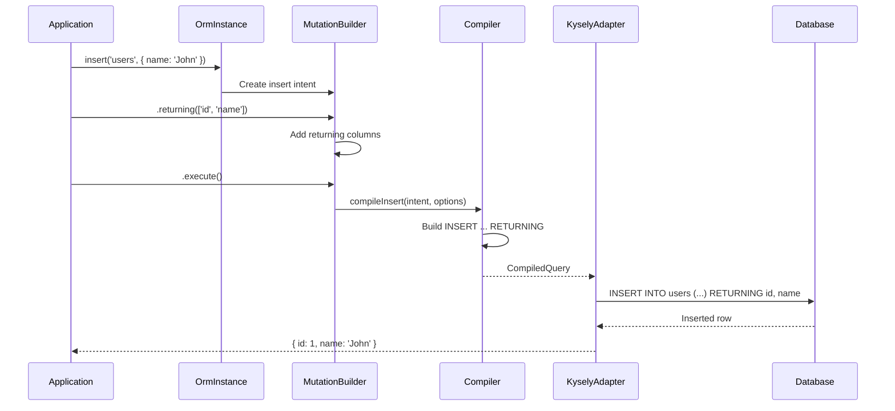
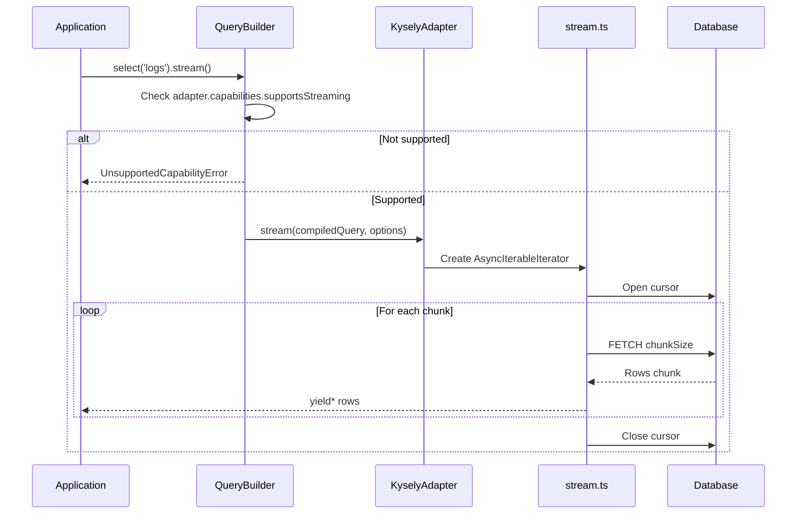

# Data Flow Analysis

## Critical Path: Query Execution

### Description

The primary path from user query to database results. This is the most frequently executed code path and represents the core value proposition of the library.

### Sequence Diagram

### Files Involved

| File | Role | Key Lines |
|------|------|-----------|
| `core/src/dx/orm.ts` | QueryBuilder, execution | L100-500 |
| `core/src/dx/intent-builder.ts` | Intent construction | L1-643 |
| `core/src/planner.ts` | Strategy decisions | L1-1475 |
| `adapter-kysely/src/compiler.ts` | SQL generation | L831-2400 |
| `adapter-kysely/src/kysely-adapter.ts` | Execution | L200-350 |

### Data Transformations

| Stage | Input | Output | Validation |
|-------|-------|--------|------------|
| QueryBuilder | Method calls | Intent accumulation | Type-safe methods |
| IntentBuilder | Builder state | QueryIntent AST | Type guards |
| Planner | QueryIntent | PlanReport | Model validation |
| Compiler | PlanReport | CompiledQuery | Dialect checks |
| Execution | CompiledQuery | DB results | Parameter binding |

### Security Checkpoints

- ✅ Input validated via TypeScript at boundary
- ✅ Schema names validated via `validateIdentifier()`
- ✅ Parameters bound (never interpolated)
- ✅ Audit logging via `dump()` observability

### Issues

| Issue | Location | Impact |
|-------|----------|--------|
| Large compile function | compiler.ts:831 | Maintainability |

---

## Critical Path: Multi-tenant Query

### Description

Query execution with schema-based tenant isolation. Critical for SaaS deployments.

### Sequence Diagram

### Files Involved

| File | Role | Key Lines |
|------|------|-----------|
| `core/src/dx/orm.ts` | withSchema() method | L120-140 |
| `core/src/dx/errors.ts` | InvalidIdentifierError | L50-80 |
| `adapter-kysely/src/compiler.ts` | Schema prefixing | L64, 128, 166 |
| `adapter-kysely/src/kysely-adapter.ts` | withSchema() | L100-120 |

### Data Transformations

| Stage | Input | Output | Validation |
|-------|-------|--------|------------|
| withSchema | Raw schema name | Validated name | Regex pattern |
| Compiler | schemaName option | Prefixed SQL | N/A |
| Execution | Prefixed query | Scoped results | DB isolation |

### Security Checkpoints

- ✅ Schema name validated against `IDENTIFIER_PATTERN`
- ✅ Schema passed to Kysely's native `withSchema()`
- ✅ Subqueries (EXISTS) also receive schema prefix
- ✅ No SQL injection possible via schema name

### Issues

| Issue | Location | Impact |
|-------|----------|--------|
| None identified | - | - |

---

## Critical Path: Mutation with Returning

### Description

Insert/update/delete operations with RETURNING clause for immediate result access.

### Sequence Diagram

### Files Involved

| File | Role | Key Lines |
|------|------|-----------|
| `core/src/dx/mutation-builders.ts` | Insert/Update/Delete builders | L1-877 |
| `adapter-kysely/src/compiler.ts` | compileInsert | L1025-1050 |
| `adapter-kysely/src/compiler.ts` | compileUpdate | L1052-1088 |
| `adapter-kysely/src/compiler.ts` | compileDelete | L1090-1125 |
| `adapter-kysely/src/compiler.ts` | compileUpsert | L1127-1355 |

### Data Transformations

| Stage | Input | Output | Validation |
|-------|-------|--------|------------|
| MutationBuilder | User data | MutationIntent | Type-safe API |
| Compiler | MutationIntent | SQL + params | Type mapping |
| Execution | CompiledQuery | DB results | Param binding |

### Security Checkpoints

- ✅ Values passed as parameters (never interpolated)
- ✅ Column names validated at compile time
- ✅ RETURNING columns validated against schema

### Issues

| Issue | Location | Impact |
|-------|----------|--------|
| RETURNING requires dialect support | dialect.ts | Feature availability |

---

## Critical Path: Streaming Query

### Description

Large result set processing via cursor-based streaming.

### Sequence Diagram

### Files Involved

| File | Role | Key Lines |
|------|------|-----------|
| `core/src/dx/orm.ts` | stream() method | L800-850 |
| `adapter-kysely/src/stream.ts` | streamQuery() | L1-277 |
| `adapter-kysely/src/kysely-adapter.ts` | stream() method | L300-320 |

### Data Transformations

| Stage | Input | Output | Validation |
|-------|-------|--------|------------|
| QueryBuilder | Query intent | Capability check | Dialect support |
| Adapter | CompiledQuery | Cursor | Transaction |
| Stream | DB cursor | AsyncIterableIterator | Chunk size |

### Security Checkpoints

- ✅ Same security as regular queries
- ✅ Cursor isolated within transaction
- ✅ Memory-bounded via chunk size

### Issues

| Issue | Location | Impact |
|-------|----------|--------|
| Requires transaction support | stream.ts | DB-specific |

---

## Summary: Critical Paths

| Path | Frequency | Security | Complexity | Health |
|------|-----------|----------|------------|--------|
| Query Execution | Very High | ✅ | High | 🟢 |
| Multi-tenant Query | High | ✅ | Medium | 🟢 |
| Mutation + Returning | High | ✅ | Medium | 🟢 |
| Streaming Query | Low | ✅ | Medium | 🟢 |

All critical paths have proper security checkpoints and are well-tested.
