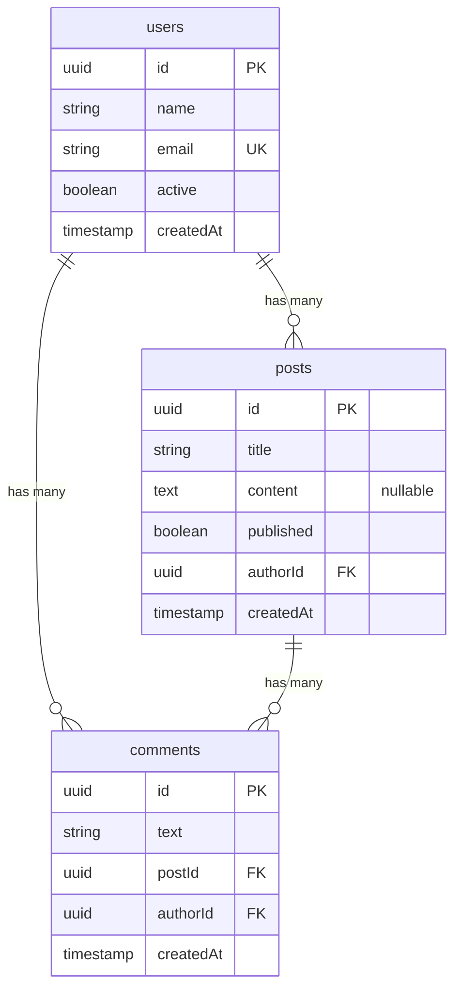

# Getting Started with db-semantic-planner

`@dbsp/core` is an intent-first query planner for PostgreSQL: you declare what data you need, the planner decides how to fetch it, and every decision is inspectable. This guide takes you from installation to your first production-ready query in about 15 minutes.

## Overview

| Step | Topic | What you'll learn |
|:----:|-------|-------------------|
| 1 | [Install](#step-1-install) | Add packages to your project |
| 2 | [Schema](#step-2-define-your-schema) | Define tables and relations |
| 3 | [Connect](#step-3-connect-to-postgresql) | Create ORM instance |
| 4 | [Query](#step-4-your-first-query) | Select, filter, type inference |
| 5 | [Relations](#step-5-include-relations) | Include related data |
| 6 | [Mutations](#step-6-mutations) | Insert, update, delete, upsert |
| 7 | [Observe](#step-7-observability-with-dump) | Inspect SQL and plan decisions |
| 8 | [Multi-tenant](#step-8-multi-tenant-queries) | Schema-per-tenant isolation |
| 9 | [Paginate](#step-9-pagination) | Offset and cursor pagination |
| 10 | [Next steps](#step-10-whats-next) | Advanced guides |

---

## Step 1: Install

::: code-group
```bash [pnpm]
pnpm add @dbsp/core @dbsp/adapter-pgsql pg
```

```bash [npm]
npm install @dbsp/core @dbsp/adapter-pgsql pg
```

```bash [yarn]
yarn add @dbsp/core @dbsp/adapter-pgsql pg
```
:::

`pg` is the PostgreSQL client — install it alongside the adapter.

::: tip
`pg` is a peer dependency — you need it to connect to PostgreSQL, but `@dbsp/core` works without it for compile-only mode.
:::

---

## Step 2: Define Your Schema

All examples in this guide (and most other guides) use the same schema: a simple **blog application** with users, posts, and comments. Here is the entity-relationship diagram:



In dbsp, you declare this schema in TypeScript:

```typescript
import { schema, ref } from '@dbsp/core';

const db = schema({
  users: {
    id: { type: 'uuid', primaryKey: true },
    name: 'string',
    email: { type: 'string', unique: true },
    active: { type: 'boolean', default: 'true' },
    createdAt: { type: 'timestamp', default: 'now()' },
  },
  posts: {
    id: { type: 'uuid', primaryKey: true },
    title: 'string',
    content: { type: 'text', nullable: true },
    authorId: ref('users', { onDelete: 'CASCADE', inverse: 'posts' }),
    published: { type: 'boolean', default: 'false' },
    createdAt: { type: 'timestamp', default: 'now()' },
  },
  comments: {
    id: { type: 'uuid', primaryKey: true },
    text: 'string',
    postId: ref('posts', { onDelete: 'CASCADE' }),
    authorId: ref('users'),
    createdAt: { type: 'timestamp', default: 'now()' },
  },
});
```

`ref()` declares a foreign-key relation. The planner auto-infers `belongsTo` (N:1) and `hasMany` (1:N) directions from FK placement. `nullable: true` in a column definition makes the column optional — the TypeScript type becomes `T | null`.

::: info Schema from database
Already have a database? Use `dbsp introspect` to generate the schema from your existing tables. See the [CLI guide](/guide/production) for details.
:::

---

## Step 3: Connect to PostgreSQL

```typescript
import { createOrm } from '@dbsp/core';
import { createPgsqlAdapter } from '@dbsp/adapter-pgsql';
import { Pool } from 'pg';

const pool = new Pool({ connectionString: process.env.DATABASE_URL });
const orm = createOrm({
  schema: db,
  adapter: createPgsqlAdapter(pool),
});
```

That is the full setup. `createOrm` returns a typed ORM instance where every table name and column is autocompleted from your schema.

::: warning
Never commit your `DATABASE_URL` to version control. Use environment variables or a `.env` file.
:::

---

## Step 4: Your First Query

```typescript
import { eq } from '@dbsp/core';

// Returns User[] — fully typed from schema
const activeUsers = await orm.select('users')
  .where(eq('active', true))
  .orderBy('name')
  .all();

// first() returns User | undefined
const alice = await orm.select('users')
  .where(eq('email', 'alice@example.com'))
  .first();

// firstOrThrow() throws NotFoundError when nothing matches
const user = await orm.select('users')
  .where(eq('id', someId))
  .firstOrThrow();
```

Types flow automatically from the schema definition through every call in the chain. The return type of `.all()` is `Promise<Array<{ id: string; name: string; email: string; active: boolean; createdAt: Date }>>` — no manual type annotation needed.

```typescript
// TypeScript infers: User[]
// where User = { id: string; name: string; email: string; active: boolean; createdAt: Date }
```

Common filter helpers: `eq`, `neq`, `gt`, `gte`, `lt`, `lte`, `like`, `inArray`, `isNull`, `isNotNull`, `and`, `or`, `not`.

::: tip Try it
Paste this NQL equivalent in the [Playground](/playground): `users | where active = true | select id, name`
:::

---

## Step 5: Include Relations

```typescript
import { eq } from '@dbsp/core';

// Load users with their posts (nested hydration)
const users = await orm.select('users')
  .where(eq('active', true))
  .include('posts')
  .all();
// users[0].posts — Post[]

// Deep nesting with dot notation
const users = await orm.select('users')
  .include('posts.comments')
  .all();
// users[0].posts[0].comments — Comment[]

// Filter and select within an include
const users = await orm.select('users')
  .include('posts', {
    where: eq('published', true),
    select: { type: 'fields', fields: ['id', 'title'] },
  })
  .all();
```

The planner selects the optimal fetch strategy (`json_agg`, lateral join, or separate query) based on the query shape. You do not choose the strategy — that is the planner's job.

::: tip Try it
Paste this NQL equivalent in the [Playground](/playground): `users | where active = true | select id, name`
:::

---

## Step 6: Mutations

All mutations require an explicit `.execute()` call. Use `.returning()` to get back column values.

```typescript
import { eq } from '@dbsp/core';

// Insert a single row
const [newUser] = await orm.insert('users')
  .values({ name: 'Alice', email: 'alice@example.com' })
  .returning(['id', 'name', 'createdAt'])
  .execute();

// Update rows matching a condition
await orm.update('users')
  .set({ active: false })
  .where(eq('email', 'alice@example.com'))
  .execute();

// Delete rows matching a condition
await orm.delete('posts')
  .where(eq('published', false))
  .execute();

// Upsert — insert or update on conflict
await orm.upsert('users')
  .values({ name: 'Alice', email: 'alice@example.com', active: true })
  .onConflict(['email'])
  .doUpdate()
  .execute();
```

::: danger Safety guard
`orm.update()` and `orm.delete()` **require** a `.where()` clause. Calling `.execute()` without one throws an error. Use `orm.updateAll()` or `orm.deleteAll()` for intentional full-table operations.
:::

::: tip Try it
Paste this NQL equivalent in the [Playground](/playground): `users | where active = true | select id, name`
:::

---

## Step 7: Observability with dump()

Every query builder exposes `.dump()`. It compiles the query without executing it and returns the full plan, SQL, and bound parameters.

```typescript
import { eq } from '@dbsp/core';

const dump = orm.select('users')
  .where(eq('active', true))
  .include('posts')
  .dump();

console.log(dump.sql);
// SELECT "t0"."id", "t0"."name", ..., json_agg(...) AS "posts"
// FROM "users" AS "t0"
// LEFT JOIN "posts" AS "t1" ON "t1"."author_id" = "t0"."id"
// WHERE "t0"."active" = $1
// GROUP BY "t0"."id"

console.log(dump.params);
// [true]

console.log(dump.plan!.decisions);
// [{ type: 'include-strategy', relation: 'posts', choice: 'json_agg', reason: '...' }]

console.log(dump.plan!.warnings);
// [] — empty means no performance concerns
```

`dump()` is safe to call in tests and logging pipelines — no database connection required.

::: tip Compile-only mode
You can use `createPgsqlCompileOnlyAdapter()` instead of `createPgsqlAdapter(pool)` to preview SQL without a database connection. Perfect for testing and development.
:::

---

## Step 8: Multi-Tenant Queries

`orm.withSchema()` scopes every query and mutation to a PostgreSQL schema (namespace). This is the standard pattern for row-level tenant isolation.

```typescript
// All queries against tenant_42's schema
const tenantOrm = orm.withSchema('tenant_42');

const users = await tenantOrm.select('users').all();
// SQL: SELECT * FROM "tenant_42"."users"

await tenantOrm.insert('users')
  .values({ name: 'Bob', email: 'bob@tenant42.com' })
  .execute();
// SQL: INSERT INTO "tenant_42"."users" ...
```

Schema names are validated as identifiers before use.

---

## Step 9: Pagination

```typescript
import { eq } from '@dbsp/core';

// Offset-based pagination
const page = await orm.select('posts')
  .where(eq('published', true))
  .orderBy('createdAt', 'desc')
  .paginate({ page: 1, perPage: 20 });

// page.data              — Post[]
// page.pagination.total       — total row count
// page.pagination.totalPages  — number of pages
// page.pagination.hasNextPage — boolean

// Cursor-based pagination (stable under concurrent inserts)
const first = await orm.select('posts')
  .orderBy('createdAt', 'desc')
  .cursorPaginate({ first: 20 });

// first.data       — Post[]
// first.nextCursor — opaque cursor string

const second = await orm.select('posts')
  .orderBy('createdAt', 'desc')
  .cursorPaginate({ first: 20, after: first.nextCursor });
```

Prefer cursor pagination for feeds and infinite scroll — it remains stable when rows are inserted between pages. Offset pagination is simpler to expose in REST APIs.

---

## Step 10: What's Next

- **Expression primitives** — `op()`, `fn()`, `ref()`, `cast()`, vector distance, ParadeDB search: [Expression Primitives](./expression-primitives)
- **Manual joins** — flat `JOIN` without nested hydration, self-joins, explicit ON conditions: [Joins](./joins)
- **DDL helpers** — `truncate`, `vacuum`, `alterColumn`, index management: [DDL Helpers](./ddl-helpers)
- **Recursive CTEs** — tree traversal with ancestors/descendants: [Recursive CTEs](./recursive-cte)
- **Full API reference** — complete method listing with all options: [API Reference](/api/)

