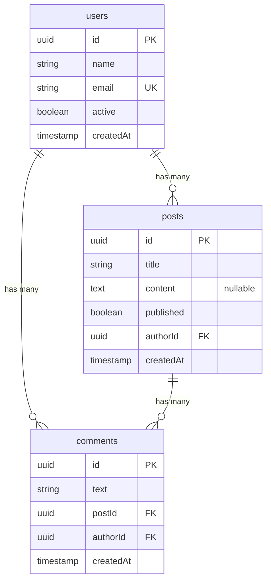

# Schema Definition

The schema is the foundation of dbsp. It describes your tables, columns, and relations in TypeScript. The planner uses it to auto-resolve includes, choose join strategies, and provide full type inference from schema to query results.

## Two Forms of Column Definitions

Columns can be defined as a **shorthand string** (just the type) or as an **object** with options:

```typescript
// Shorthand — simplest form
name: 'string',

// Object — with options (nullable, unique, default, primaryKey, etc.)
email: { type: 'string', unique: true },
content: { type: 'text', nullable: true },
id: { type: 'uuid', primaryKey: true },
```

## Example Schema

Here is a typical blog schema with users, posts, and comments:



In dbsp:

```typescript
import { schema, ref } from '@dbsp/core';

const db = schema({
  users: {
    id: 'uuid',
    name: 'string',
    email: 'string',
    active: 'boolean',
    createdAt: 'timestamp',
  },
  posts: {
    id: 'uuid',
    title: 'string',
    content: { type: 'text', nullable: true },
    authorId: ref('users'), // foreign key -> users.id
    published: 'boolean',
  },
});
```

## Column Types

| Type | PostgreSQL | Notes |
|------|------------|-------|
| `'string'` | `text` | |
| `'text'` | `text` | |
| `'integer'` | `integer` | |
| `'bigint'` | `bigint` | |
| `'decimal'` | `decimal` | |
| `'uuid'` | `uuid` | |
| `'boolean'` | `boolean` | |
| `'timestamp'` | `timestamptz` | |
| `'date'` | `date` | |
| `'time'` | `time` | |
| `'json'` | `json` | |
| `'jsonb'` | `jsonb` | |

Use `{ type: 'text', nullable: true }` for nullable columns.

## Relations

Use `ref()` to define foreign key relationships. The planner auto-infers `belongsTo` (N:1) and `hasMany` (1:N) directions from FK placement.

```typescript
// Simple FK — targets the primary key of the referenced table
authorId: ref('users'),

// Optional FK (nullable)
editorId: ref('users', { nullable: true }),

// 1:1 relation (unique FK)
profileId: ref('users', { unique: true }),

// Custom relation names
createdById: ref('users', { as: 'creator', inverse: 'createdPosts' }),

// Cascade on delete
authorId: ref('users', { onDelete: 'CASCADE' }),

// Self-referential (hierarchies) — roles are required
parentId: ref('categories', {
  nullable: true,
  roles: { parent: 'parent', children: 'children' },
}),
```

### ref() Options

| Option | Description |
|--------|-------------|
| `nullable` | Make the FK optional (0..N instead of 1..N) |
| `unique` | Make the relation 1:1 instead of N:1 |
| `onDelete` | `'CASCADE'`, `'SET NULL'`, `'RESTRICT'`, `'NO ACTION'` |
| `onUpdate` | Same options as `onDelete` |
| `as` | Custom name for this relation direction |
| `inverse` | Custom name for the reverse relation on the target table |
| `roles` | Required for self-referential tables: `{ parent, children }` |

The planner uses these relations to auto-resolve `.include()` calls and choose optimal join strategies.
